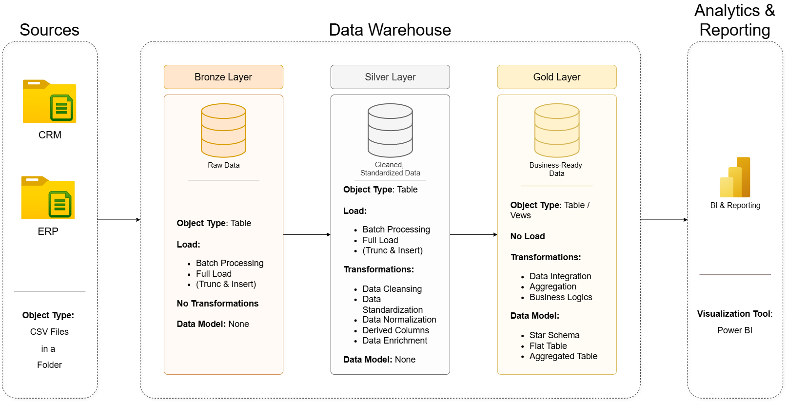
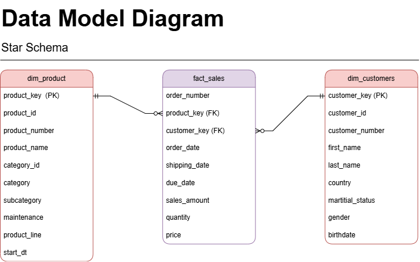
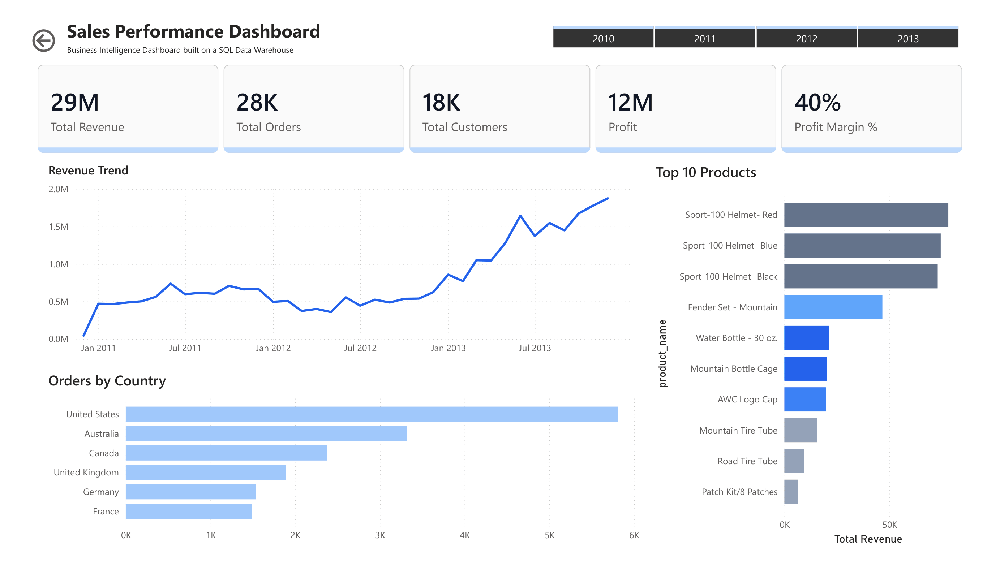

# SQL Data Warehouse Project

## Overview

This project demonstrates the design and implementation of a modern Data Warehouse using the Medallion Architecture (Bronze, Silver, and Gold layers) in SQL Server.

The solution integrates CRM and ERP source data, applies data quality transformations, and delivers analytics-ready datasets through a dimensional model optimized for reporting and business intelligence.

> Note: This project was built by following and recreating a data engineering tutorial for educational purposes. The implementation, analysis, testing, documentation, and dashboard development were completed as part of my learning journey in Data Engineering and Analytics.

---

## Project Architecture



### Bronze Layer

* Stores raw source data from CRM and ERP systems
* Loaded using BULK INSERT
* No transformations applied
* Serves as the historical source of truth

### Silver Layer

* Performs data cleansing and standardization
* Handles missing values and duplicates
* Applies business rules and data quality checks
* Produces clean and consistent datasets

### Gold Layer

* Creates business-ready analytical datasets
* Implements dimensional modeling
* Builds fact and dimension views
* Supports reporting and dashboarding use cases

---

## Data Model



### Dimension Tables

* dim_customers
* dim_product

### Fact Table

* fact_sales

The Gold Layer follows a Star Schema design using surrogate keys and consolidated business entities for analytical reporting.

---

## ETL Process

```text
CRM / ERP Sources
        ↓
    Bronze Layer
        ↓
    Silver Layer
        ↓
     Gold Layer
        ↓
     Power BI
```

The ETL process is implemented using SQL Server stored procedures and follows a full-load pattern using truncate-and-insert operations.

---

## Power BI Dashboard



### Key Metrics

* Total Revenue
* Total Orders
* Total Customers
* Profit
* Profit Margin %

### Business Insights

* Revenue Trend Analysis
* Revenue by Category
* Orders by Country
* Top Performing Products

---

## Technologies Used

* SQL Server
* T-SQL
* Power BI
* Data Warehousing
* ETL / ELT
* Medallion Architecture
* Star Schema Modeling
* Git
* GitHub

---

## Key Concepts Practiced

* Data Warehouse Design
* Medallion Architecture
* Data Cleansing and Standardization
* Data Quality Validation
* Fact and Dimension Modeling
* Surrogate Key Generation
* ETL Pipeline Development
* Business Intelligence Reporting

---

## Learning Outcomes

Through this project, I gained practical experience with:

* Designing layered data warehouse architectures
* Building ETL pipelines in SQL Server
* Creating dimensional models for analytics
* Implementing data quality transformations
* Developing Power BI dashboards on top of warehouse data
* Applying industry-standard Data Engineering concepts in an end-to-end solution
